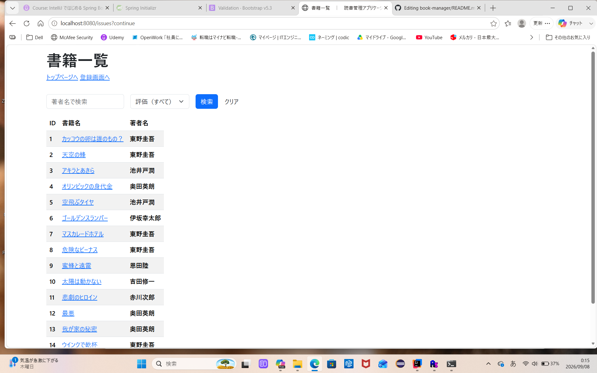
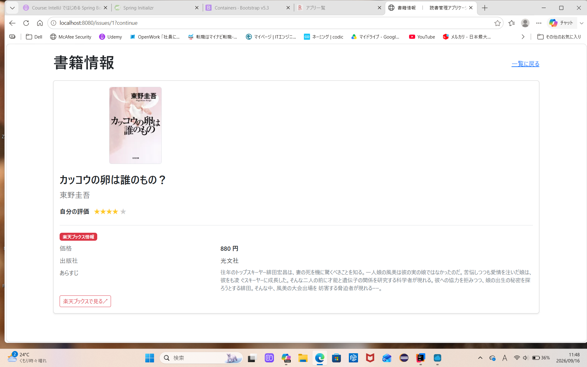

# Book Manager

 

Spring Bootを使用して開発した書籍管理アプリケーションです。

 

## 概要

 

ユーザーが書籍情報を登録・管理できるWebアプリケーションです。
書籍の登録機能、書籍の詳細情報閲覧機能、作者と評価による絞り込み検索機能などを実装しております。
書籍詳細では楽天ブックスの情報を取り込み、表示しております。
 


## 主な機能

 

- ユーザー登録
  
- ログイン

- 書籍登録

- 書籍一覧表示

- 書籍詳細表示

- 絞り込み検索

 

## 使用技術

 

### Backend

 

- Java
  
- Spring Boot
  
- Spring Security
  
- Spring Data JPA
  
- Hibernate
  
 

### Frontend

 

- Thymeleaf

- HTML
  
- CSS
  
 

### Database

 

- MySQL

 

### Build Tool/API

 

- Gradle

- Rakuten Books API

## テスト

本プロジェクトでは、JUnitを使用してController、Serviceなどのテストを実装しています。

### テスト実行

Windows:

```bash
gradlew.bat test
```
 

## 画面イメージ(書籍リスト)

 



 
## 画面イメージ(詳細画面)





## 起動方法

 

### リポジトリをクローン

 

```bash

git clone https://github.com/yuhei-dev-tec/book-manager.git

```

 

### プロジェクトディレクトリへ移動

 

```bash

cd book-manager

```

 

### アプリケーション起動

 

```bash

./gradlew bootRun

```

 

または IntelliJ IDEA から

 

```text

BookManagerApplication

```

 

を実行してください。

 

## 学習ポイント

 

- Spring Securityによる認証・認可
  
- JPAによるデータ永続化
  
- MVCアーキテクチャ
  
- フォームバリデーション
  
- CRUD機能の実装

- 外部APIの活用
  
 

 

## 作者
 

GitHub: https://github.com/yuhei-dev-tec
